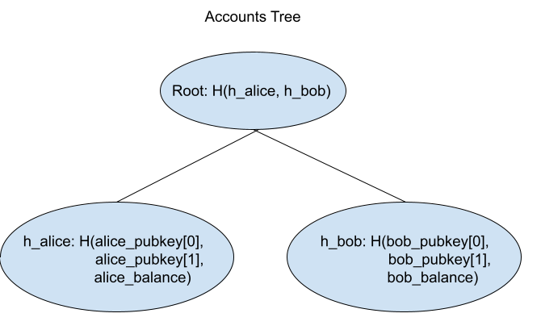
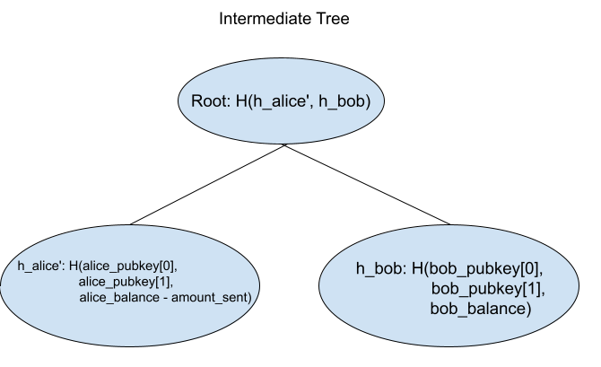
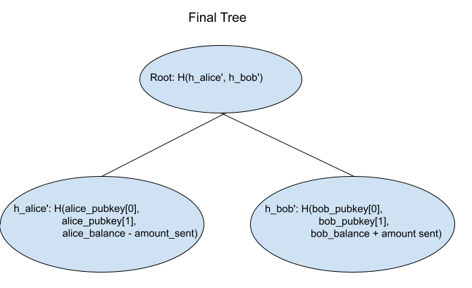

# Processing one transaction
One way of implementing rollups is with the use of merkle-trees. This means we can commit the merkle-root to the layer-1 chain and the deltas of the balances of the users instead of submitting each individual 

## Setup:
Assume Alice is the sender and Bob the receiver of the transaction.

Current implementation assumes merkle-tree only has one level and thus is only able to fit Alice and Bob onto this rollup. This can easily be changed on the parameters of the merkle-trees used both in the circuit and in generate_circuit_input.js

Alice starts with: 500 coins
bob starts with: 0 coins

Each user's commitment onto the merkle-tree consists of: `Hash(userPubkey[0], userPubkey[1], userBalance)`.

For verifying a function, we'll need a few steps on the circuit.

1. Check if sender exists with current balance initial merkle-tree

2. Check if alice has signed the transaction
3. Debiting Alice's account
4. Checking if intermediate root matches the one received as input. Note that the intermediate root correspond to the merkle-tree with Alice's account debited and Bob's account unchanged.

5. Check if Bob exists at initial merkle-root
6. Credit Bob's account
7. Output new merkle-root with Alice's account debited and Bob's account credited.

Note that you need to copy your solution for eddsa to this directory!

To see how multiple transactions would be handled (warning: old version of circom/circomlib) you can check here: 
https://github.com/rollupnc/RollupNC/blob/master/circuits/update_state_verifier.circom
